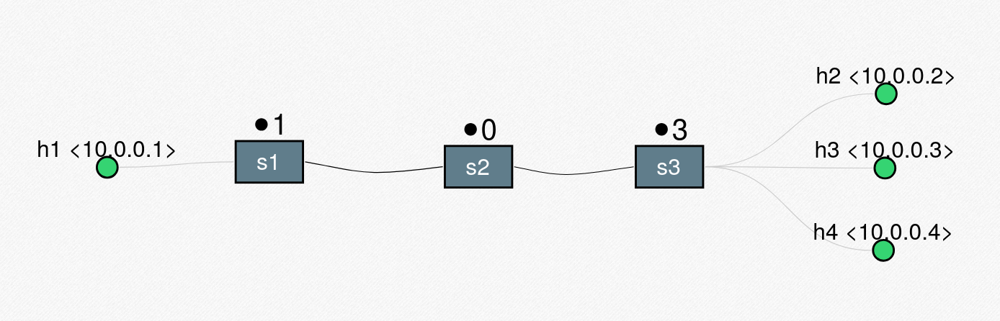
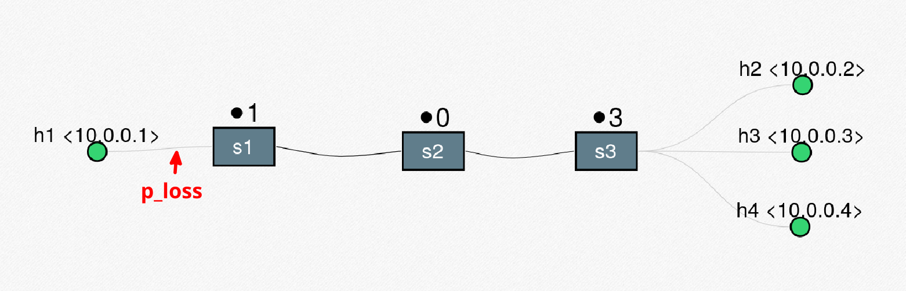

# TP1-Redes

### Table of contents

1. [How to run](#How-to-run)
1. [Mininet](#Mininet)
    1. [LinearEnds topology](#LinearEnds-topology)
    1. [Launch parameters](#Launch-parameters)
    1. [Visualize packet loss](#Visualize-packet-loss)
    1. [Visualize MTU fragmentation](#Visualize-MTU-fragmentation)
1. [Tests]
    1. [Mininet IP Fragmentation tests](#Mininet-IP-Fragmentation-tests)
1. [Informe](#Informe)
    1. [Compiling the PDF](#Compiling-the-PDF)
    1. [Org Mode Syntax](#Org-Mode-Syntax)
1. [Contribute](#Contribute)
    1. [Pre-commit](#Pre-commit)
    1. [Nix](#Nix)
        1. [devenv](#devenv)
        1. [direnv](#direnv)
1. [References](#References)

# How to run

Run mininet with the following command:

```bash
sudo mn --mac --custom ./mininet/linear_ends_topo.py --topo linends,n,p_loss --link tc
```

Where:
- `n`: is the number of clients, by default is `1`
- `p_loss`: is the packet loss probability as a percentage (integer between `0` and `100`), by default is `0`.

  This works by halving the value and applying each half to each side of the link. So 100% probability means 50% per side (averaging 75% probability overall), and 200% probability would be 100% per side, this does not mean no packet can pass, it is a probability.

If you simply run:

```bash
sudo mn --mac --custom ./mininet/linear_ends_topo.py --topo linends
```

It is assumed `n=1` and `p_loss=0`, given there is no loss `--link tc` is no longer necessary.

More about LineadEnds in the next section.

# Mininet

## LinearEnds topology

The LineadEnds topology is a custom topology that by default has 1 host at one end, let's call it Server, and 1 host at the other end, let's call it Client, with 3 switches as intermediaries.

<p align="center">
  
</p>

There is one customization parameter for adding more hosts to the right end, a.k.a. adding more Clients.

<p align="center">
  
</p>


## Launch parameters

To launch Mininet with the LinearEnds topology execute the next command:

```bash
sudo mn --mac --custom ./mininet/linear_ends_topo.py --topo linends
```

The `--mac` argument is to simplify the MAC addresses of the hosts making the more semantic.

To have more Client hosts, let's say `n` total client hosts, execute the next command:

```bash
sudo mn --mac --custom ./mininet/linear_ends_topo.py --topo linends,n
```

To add a certain packet loss percentage, let's say `p_loss` (expressed as an integer between `1` and `100`), in the link between the server (h1) and its switch (s1) you have to execute the next command:

```bash
sudo mn --mac --custom ./mininet/linear_ends_topo.py --topo linends,n,p_loss --link tc
```

Where `--link tc` is to setup the link type as TrafficControl to be able to modify the packet loss.

<p align="center">
  
</p>

If you don't have Mininet run in Linux the script `scripts/install_deps.sh` or you can install visit: [Mininet website: downloads](http://mininet.org/download/).

## Visualize packet loss

Once mininet is up with a certain packet loss setup:

```bash
sudo mn --mac --custom ./mininet/linear_ends_topo.py --topo linends,n,p_loss --link tc
```

Open xterm terminals in 2 hosts, let's say h1 and h2:

```bash
mininet> xterm h1 h2
```

To run a simple HTTP over TCP server on h1 run:

```bash
python3 -m http.server 8080
```

Then establish the connection from h2 with:

```bash
curl 10.0.0.1:8080
```

If Wireshark is tapping into a switch the packets will be visualized.

## Visualize MTU fragmentation

Once mininet is up with a certain MTU defined:

```bash
sudo mn --mac --custom ./linear_ends_topo.py --topo linends,n,mtu --link tc
```

Open xterm terminals on hosts h1 and h2:

```bash
mininet> xterm h1 h2
```

Open Wireshark on s2:

```bash
mininet> s2 wireshark &
```

Inside Wireshark is recommended to select eth-0 on s2 and select a maximum number of packets to avoid filling up all your memory, e.g. 100.000 packets is OK.

#### TCP Fragmentation

By default iperf uses TCP.

The iperf (works on both iperf and iperf3) server must run on h1's xterm:

```bash
iperf3 -s
```

Then run the client on h2's xterm:

```bash
iperf3 -c 10.0.0.1
```

#### UDP Fragmentation

iperf3 auto starts listening both TCP and UDP so no need for flag for the server on h1's xterm:

```bash
iperf3 -s
```

For normal iperf:

```bash
iperf -s -u
```

Then run the client on h2's xterm with UDP flag:

```bash
iperf3 -c 10.0.0.1 -u
```

#### Disclaimer

Given the node that can fragment is in the middle and the MTU is lowered on the link s2->s1 fragmentation will only occur for traffic that travels from h2 -> h1 (a.k.a. server in h1, client in h2), if traffic going h1 -> h2 needs to be fragmented it will end up being dropped by the switch s1, because it cannot fragment like s2 does.

# Tests

## Mininet IP Fragmentation tests

To run IP fragmentation tests for the LinearEnds topology run the tests with the next command:

```bash
sudo python3 ./mininet/fragmentation_tests.py
```

# Informe

The informe.pdf file is generated using Org Mode that uses LaTeX to generate the PDF. To generate the PDF, you need to have some system dependencies which can be used from the Nix devenv or installed from your distribution.

You need to have Emacs and Org Mode installed on your system. You can install Emacs by following the instructions on the [Emacs website](https://www.gnu.org/software/emacs/).

Also you need to have LaTeX installed on your system. You can install LaTeX by following the instructions on the [LaTeX website](https://www.latex-project.org/get/).

## Compiling the PDF
To compile the PDF, you need to run the following command:

```bash
make
```

## Org Mode Syntax
To learn more about Org Mode syntax, you can refer to this [Org Mode Cheat Sheet](https://emacsclub.github.io/html/org_tutorial.html).

# Contribute

## Pre-commit

Pre-commit hooks are run on every commit.

To install pre-commit, run the following command:

```bash
pip install pre-commit
```

Then, run the following command to install the pre-commit hooks:

```bash
pre-commit install
```

To run all pre-commit hooks without making a commit run:

```shell
pre-commit run --all-files
```

To create a commit without running the pre-commit hooks run:

```shell
git commit --no-verify
```

## Nix

### devenv
To use the Nix development environment, you need to have Nix installed on your system. You can install Nix by following the instructions on the [Determinate Nix Installer page](https://github.com/DeterminateSystems/nix-installer).

Once you have Nix installed, you need to install devenv. You can do this by running the following command:

```bash
nix profile install nixpkgs\#devenv
```

Then, you can enter the development environment by running the following command:

```bash
devenv shell
```

### direnv

Optionally, you can install direnv to automatically load the development environment when you enter the project directory. You can do this by running the following command:

```bash
nix profile install nixpkgs\#direnv
```

Then, allow direnv to load the development environment by running the following command:

```bash
direnv allow
```

# References

- [Spear Narmox: Mininet tpology graphing tool](http://demo.spear.narmox.com/app/?apiurl=demo#!/mininet)
